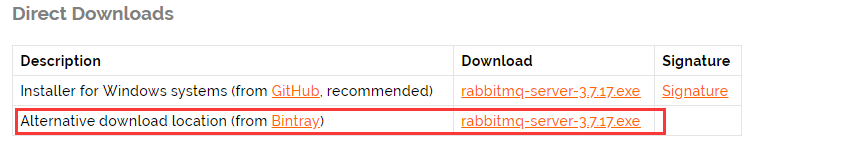
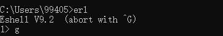
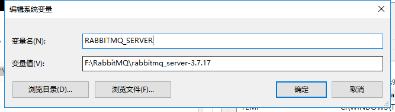
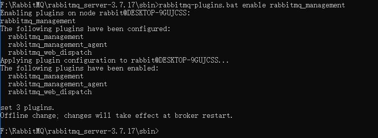
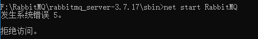
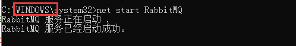
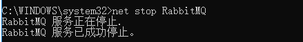
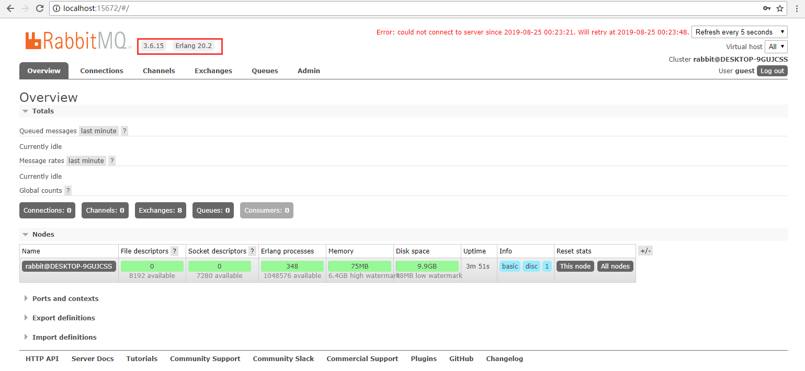

## RabbitMQ

### RabbitMQ的安装

因为RabbitMQ是Erlang语言编写的，且遵循AMQP规范（消息中间件的规范），所以我们需要下载Erlang的，并安装它。

```
链接：https://pan.baidu.com/s/1SfJjPfm_-ORbZ8b7wjKOhQ 
提取码：zk64 
```

这个操作，下一步下一步就可以。安装完成后，我们安装window版本的RabbitMQ

```
https://www.rabbitmq.com/install-windows.html
```



配置erl的环境变量和Path

```
ERLANG_HOME=C:\Program Files\erl9.2
path=%ERLANG_HOME%\bin
```

cmd查看erl如果有提示，说配置成功。



然后配置RabbitMQ环境变量



加入path

```
%RABBITMQ_SERVER%\sbin
```

然后cd到sbin目录下，输入命令。

```
rabbitmq-plugins.bat enable rabbitmq_management
```



激活`rabbitmq_management`成功。

然后直接启动RabbitMQ服务。启动过程中可能会存在一个问题就是



出现这种原因是因为权限不足，如果你是admin的话，就不会用这个问题了，所以我们到

```
c:/window/system32/cmd.exe 使用管理员权限打开，然后再运行 net start RabbitMQ 指令
```



关闭的命令

```
net stop RabbitMQ
```



不过这里还有一个问题，就是这里已经显示了启动成功，我们使用网址还是无法打开管理页面，所以我们可以查看一下RabbitMQ的输出日志。

```
C:\Users\***\AppData\Roaming\RabbitMQ\log
```

然后我们发现一个这样的错误

```per
2019-08-24 22:51:19.480 [info] <0.33.0> Application rabbit_common started on node 'rabbit@DESKTOP-9GUJCSS'
2019-08-24 22:51:19.481 [error] <0.203.0> This RabbitMQ version cannot run on Erlang 20.2 (erts 9.2): minimum required version is 20.3 (erts 9.3)
2019-08-24 22:51:19.481 [error] <0.202.0> CRASH REPORT Process <0.202.0> with 0 neighbours exited with reason: {{erlang_version_too_old,"Erlang 20.3 or later is required, started on 20.2"},{rabbit,start,[normal,[]]}} in application_master:init/4 line 134
2019-08-24 22:51:19.481 [info] <0.33.0> Application rabbit exited with reason: {{erlang_version_too_old,"Erlang 20.3 or later is required, started on 20.2"},{rabbit,start,[normal,[]]}}
2019-08-24 22:51:24.743 [info] <0.33.0> Application lager started on node 'rabbit@DESKTOP-9GUJCSS'
```

大概的意思是，RabbitMQ的所需要的版本过高需要9.3的版本，而当前我所装的为9.2，所以出现错误，我们可以选择安装版本低一些的RabbitMQ，从github上

```
https://github.com/rabbitmq/rabbitmq-server/releases
```

之后访问

```
http://localhost:15672
```

默认密码

```
username:guest
password:guest
```



到此，安装成功。

### RabbitMQ的使用

