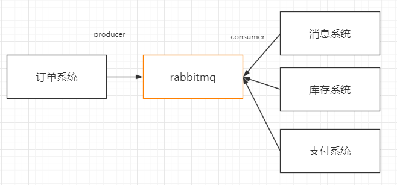
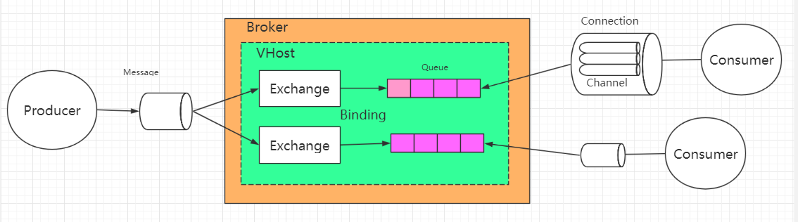
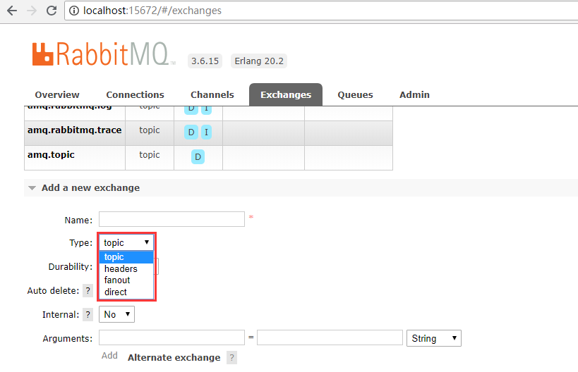
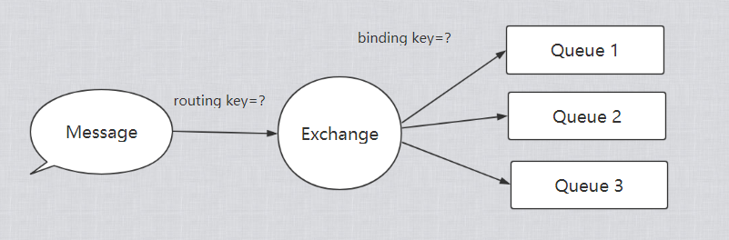
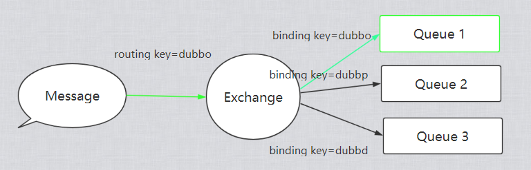
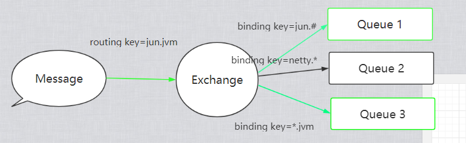
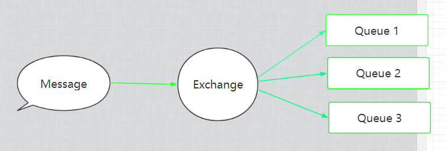
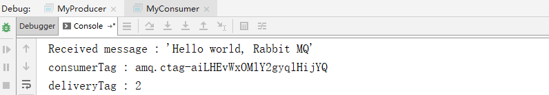
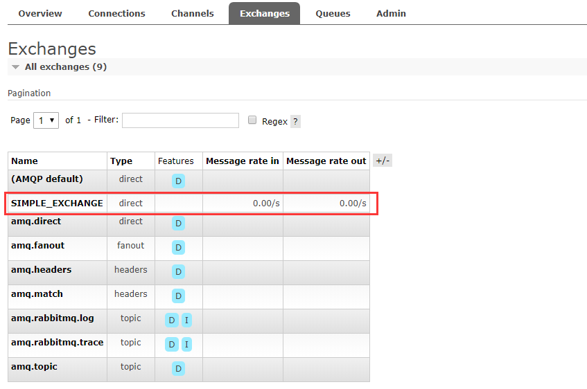
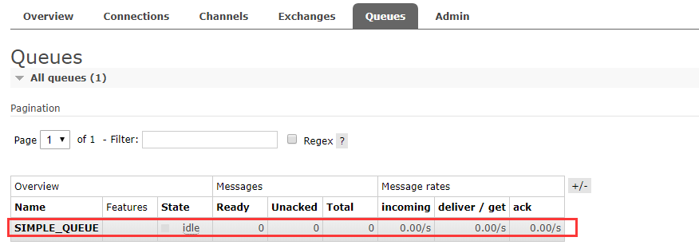

## RabbitMQ

### RabbitMQ的安装

因为RabbitMQ是Erlang语言编写的，且遵循AMQP规范（消息中间件的规范），所以我们需要下载Erlang的，并安装它。

```
链接：https://pan.baidu.com/s/1SfJjPfm_-ORbZ8b7wjKOhQ 
提取码：zk64 
```

这个操作，下一步下一步就可以。安装完成后，我们安装window版本的RabbitMQ

```
https://www.rabbitmq.com/install-windows.html
```


配置erl的环境变量和Path

```
ERLANG_HOME=C:\Program Files\erl9.2
path=%ERLANG_HOME%\bin
```

cmd查看erl如果有提示，说配置成功。


然后配置RabbitMQ环境变量


加入path

```
%RABBITMQ_SERVER%\sbin
```

然后cd到sbin目录下，输入命令。

```
rabbitmq-plugins.bat enable rabbitmq_management
```


激活`rabbitmq_management`成功。

然后直接启动RabbitMQ服务。启动过程中可能会存在一个问题就是


出现这种原因是因为权限不足，如果你是admin的话，就不会用这个问题了，所以我们到

```
c:/window/system32/cmd.exe 使用管理员权限打开，然后再运行 net start RabbitMQ 指令
```


关闭的命令

```
net stop RabbitMQ
```


不过这里还有一个问题，就是这里已经显示了启动成功，我们使用网址还是无法打开管理页面，所以我们可以查看一下RabbitMQ的输出日志。

```
C:\Users\***\AppData\Roaming\RabbitMQ\log
```

然后我们发现一个这样的错误

```per
2019-08-24 22:51:19.480 [info] <0.33.0> Application rabbit_common started on node 'rabbit@DESKTOP-9GUJCSS'
2019-08-24 22:51:19.481 [error] <0.203.0> This RabbitMQ version cannot run on Erlang 20.2 (erts 9.2): minimum required version is 20.3 (erts 9.3)
2019-08-24 22:51:19.481 [error] <0.202.0> CRASH REPORT Process <0.202.0> with 0 neighbours exited with reason: {{erlang_version_too_old,"Erlang 20.3 or later is required, started on 20.2"},{rabbit,start,[normal,[]]}} in application_master:init/4 line 134
2019-08-24 22:51:19.481 [info] <0.33.0> Application rabbit exited with reason: {{erlang_version_too_old,"Erlang 20.3 or later is required, started on 20.2"},{rabbit,start,[normal,[]]}}
2019-08-24 22:51:24.743 [info] <0.33.0> Application lager started on node 'rabbit@DESKTOP-9GUJCSS'
```

大概的意思是，RabbitMQ的所需要的版本过高需要9.3的版本，而当前我所装的为9.2，所以出现错误，我们可以选择安装版本低一些的RabbitMQ，从github上

```
https://github.com/rabbitmq/rabbitmq-server/releases
```

之后访问

```
http://localhost:15672
```

默认密码

```
username:guest
password:guest
```


到此，安装成功。

### RabbitMQ的使用

mq最早用于金融领域，之后sun公司为了统一规范，提出了jms规范，但是因为jms是java的规范，无法适用于其他语言，最后提出后AMQP规范，而这便是真正意义上跨语言的mq规范，rabbit公司通过实现了这一规范，提出了rabbitmq这项技术，而rabbitmq的编写语言为erlang

可以理解成订单系统，订单的下单，会削减库存，短信通知，支持，然后通知。等，这是可以被做成多个服务的，但是这并不是出于同一个系统的，所以这就应该是串行执行的。

所以如果由消息中间在中间，订单系统作为生产者，而库存系统和下单系统，通知系统去从中间件去消费消息，也就是一个解耦的很好的方案。



所以，rabbitmq的引入，为了解决同步系统的所带来的高延迟问题，而高流量的请求过来的时候，我也可以利用queue的特性，先进先出。将巨大的流量承接下来，之后慢慢消费。

* 异步
* 解耦
* 削峰

RabbitMQ的工作模型图



对于一个rabbitmq来说，他被定义成一个叫做Broker(中介)的一个角色，他的内部有一个VHost的东西，他可以让我们将消费请求转发或者路由到对应的exchange中，这个exchange会与若干的Queue绑定，而这个Queue就是我们想要消费的消息了，queue与exchange是多对多的关系，也就意味着，exchange将会保存多个queue的地址，也就是binding，同时queue也可以binding多个exchange。

而消费者如果想要和rabbitmq建立连接，那么就需要获得这个broker的channel才可以，这是一个http长连接，但由于http的长连接是一个很宝贵的资源，所以rabbitmq中使用channel(信道)最为connection的手段，大大减少性能的损耗，而channel也是rabbitmq中很重要的一个api。

### RabbitMQ的Queue和Kafka的Queue有什么区别

首先，Queue在消息中间件都是承载消息本生的主要载体，他们是独立运行在服务之上的进程，并且都会为他们提供相应的数据库来存储消息，在kafka中是通过50个分区的log，并对不同的offset区间来分割消息的方式进行存储，并提供snapshot，log，index，和epcho的方式加快查找，和同步副本的手段。

而在RabbitMQ中，同样的也有这样一个数据库`Mnesia`来存储消息。

而Kafka中的生产者会直接将消息打入kafka的节点上，而RabbitMQ则会先通过Exchange(交换机)，这个Exchange是一个记录着所有与他有binding关系的Queue列表，而这些关系会通过`routing key`(路由键)

来表示，只要符合要求的路由键的queue，都会发送消息。而请求会携带这种路由键来找到具体是哪一个路由，不同的路由，他们找queue的规则也不一样。

而路由也提供了四种规则，其中三种较为常用的规则



当请求通过routingkey找到对应路由器的时候，路由器会通过`binding key`（绑定键）来寻找符合要求的Queue，绑定键也是Queue与Exchange的关系纽带。



* direct 直连类型

  * routing key 与 bindin key必须一模一样，才可以被路由到对应的Queue

  * 

  * ```java
    channel.basicPublish("路由器的名字","bindingkey","消息主题")
    ```

* topic 主题类型

  * routing key 与 bindin key 可以使用通配符来匹配，#与*
    * #代表0或者多个单词
    * *不多不少于1个单词
    * 单词的含义就是以 `.`分割开来的，前面的部分被称为一个单词
      * 例如 junior.# 代表前面是junior后面是多个单词或者没有单词，所以junior可以被匹配，junior.abc.ccd也可以被匹配
      * 如果netty.* 代表只能有一个单词，所以，netty与netty.abc.cdd无法被匹配，只有netty.abc才可以被匹配成功。
      * 

* fanout 广播类型
  * 广播类型交换机没有路由键，也没有绑定键位，所以他会对所有的queue都会发送消息。和他绑定关系的queue
  * 

### 代码部分

引入依赖

```xml
 <dependency>
     <groupId>com.rabbitmq</groupId>
     <artifactId>amqp-client</artifactId>
     <version>5.6.0</version>
</dependency>
```

运行代码的时候，首先运行消费者，他会对channel进行监听。当生产者发送消息的时候，将会被消费。

```java
public class MyConsumer {
    private final static String EXCHANGE_NAME = "SIMPLE_EXCHANGE";
    private final static String QUEUE_NAME = "SIMPLE_QUEUE";

    public static void main(String[] args) throws Exception {
        ConnectionFactory factory = new ConnectionFactory();
        // 连接IP
        factory.setHost("127.0.0.1");
        // 默认监听端口
        factory.setPort(5672);
        // 虚拟机
        factory.setVirtualHost("/");

        // 设置访问的用户
        factory.setUsername("guest");
        factory.setPassword("guest");
        // 建立连接
        Connection conn = factory.newConnection();
        // 创建消息通道
        Channel channel = conn.createChannel();

        // 声明交换机  同一个name，参数必须一致，如果一个不一致都会返回错误，但是，如果你每次都定义的参数都是一模一样的，会直接返回正确，所以这段代码可以重复定义。
        // String exchange, String type, boolean durable, boolean autoDelete, Map<String, Object> arguments
        channel.exchangeDeclare(EXCHANGE_NAME,"direct",false, false, null);

        // 声明队列
        // String queue, boolean durable, boolean exclusive, boolean autoDelete, Map<String, Object> arguments
        channel.queueDeclare(QUEUE_NAME, false, false, false, null);
        System.out.println(" Waiting for message....");

        // 绑定队列和交换机
        channel.queueBind(QUEUE_NAME,EXCHANGE_NAME,"gupao.best");

        // 创建消费者
        Consumer consumer = new DefaultConsumer(channel) {
            @Override
            public void handleDelivery(String consumerTag, Envelope envelope, AMQP.BasicProperties properties,
                                       byte[] body) throws IOException {
                String msg = new String(body, "UTF-8");
                System.out.println("Received message : '" + msg + "'");
                System.out.println("consumerTag : " + consumerTag );
                System.out.println("deliveryTag : " + envelope.getDeliveryTag() );
            }
        };

        // 开始获取消息
        // String queue, boolean autoAck, Consumer callback
        channel.basicConsume(QUEUE_NAME, true, consumer);
    }
}
```

生产者。

```java
public class MyProducer {
    private final static String EXCHANGE_NAME = "SIMPLE_EXCHANGE";

    public static void main(String[] args) throws Exception {
        ConnectionFactory factory = new ConnectionFactory();
        // 连接IP
        factory.setHost("127.0.0.1");
        // 连接端口
        factory.setPort(5672);
        // 虚拟机
        factory.setVirtualHost("/");
        // 用户
        factory.setUsername("guest");
        factory.setPassword("guest");

        // 建立连接
        Connection conn = factory.newConnection();
        // 创建消息通道
        Channel channel = conn.createChannel();

        // 发送消息
        String msg = "Hello world, Rabbit MQ";

        // String exchange, String routingKey, BasicProperties props, byte[] body
        channel.basicPublish(EXCHANGE_NAME, "gupao.best", null, msg.getBytes());

        channel.close();
        conn.close();
    }
}
```







### 系统独有的RabbitMQ

倘若你这个系统用RabbitMQ用得很好，但是其他系统也想用，是否需要重新启动一个rabbitmq服务呢，其实没必要，因为rabbitmq提供了vhost的机制，相当于namesapce，你可以创建多个vhost，虚拟主机，来帮助你建立互相不影响的命名空间。

